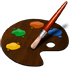

Paint JS APP
==================

  - [Output example](#output-example)
  - [Usage](#usage)
    - [Customization](#customization)
    - [Bounding your App](#webpack)
    - [Running Unit Tests](#unit-test)
  - [User Experience](#user-experience)
  - [Bugs](#bugs)
  - [Contributing](#contributing)
  - [License](#license)


### Use Your Browser as a paint Canvas !

Mobile / Desktop Paint App Developed in **JS**, **NodeJs**, **Jquery** and **Bootstrap**. Uses **Webpack** as preprocessor and **Mocha-WebPack** as Unit test Tool.

>Feel free to contribute, report bugs, share and of course enjoy Painting ! 

---

## Output example

- Destop View:


- Mobile View:


*I'm sure you can Paint Better :)*


- Unit Test View:


---

## Usage

**It's really simple!**

- Just go to your project folder and run:

		[$] git clone https://github.com/andresftenjo/PaintJS.git

-  Then Navigate in the created PaintJs folder and run:

		[$] npm start

This generates a new Localhost:3000 intance in your dev machinne, and That's It if you just needed to make run this app.


---


### Customization

- Go to your project folder and run:

		[$] npm install

    - `It will load the included app dependencies for development and customization`
    - `Confirm the recently added modules in node_nodules folder : css-loader, mocha, mocha-loader, url-loader, webpack-dev-server, webpack, etc`


- Changing your host configuration:

    Go to your project folder -> bin -> www(plain file) and confirm Your NodeJs configuration values, if you need help please take a look > 


### Webpack

Type Webpack in your project folder to verify the correct installation of this module:

        [$] webpack

If you see something like `webpack is not recognized as internal or external command...` please make sure you installed webpack locally, for more informacion please refer>
: [**Webpack Installation**](https://webpack.github.io/docs/installation.html)

Confirm webpack-dev-server tools installation using the same previous steps:

    [$] webpack-dev-server

    [$] npm install webpack -g

    [$] npm init

    [$] npm install webpack-dev-server

After confirm, you will be able to precompile and bound all your app js modules, libraries, css and more

    [$] webpack

- `After each asset change run webpack again and test it out`
- `Your Bounded File Will be Located and Updated into the /Public folder with the name bundle.js`

### Unit Test
In your project root, you can put this command `webpack-dev-server "mocha!./public/js/test/tests.js" --output-file test.js` to use your webpack-dev-server with mocha-webpack and a test instance automatically default params:

Expected Result:


```
...
...
 [built]
   [50] ./~/should/~/should-format/cjs/should-format.js 14.3 kB {0} [built]
   [51] ./~/should/~/should-equal/cjs/should-equal.js 8.39 kB {0} [built]
   [52] ./~/mocha-loader/start.js 180 bytes {0} [built]
   [53] (webpack)/~/node-libs-browser/~/process/browser.js 2.82 kB {0} [built]
webpack: bundle is now VALID.

```

- `Webpack-dev-server uses by default the instance localhost:8080 so confirm this host and port in your dev machinne`
- `use this URL to navigate directly within our tests : http://localhost:8080/webpack-dev-server/test`
- `Then you will See the Unit Test View already shown here`


---


## User Experience

- Brush Function: It's defined by default in Desktop version you can see a Brush icon as your mouse pointer when this option is active
- Erase Button: set as 'white' the fragment that you want to erase by touching or clicking under any area inside the canvas
- Fill Button: Fills any drawn Area using the current selected color 
- Color Picker: Open / Hide a defined color panel with the colors that you can use
- Undo Button: Undoing the last event that the user made inside the canvas
- Brush Size Input : The User can change the brush size from 1px to 100px in Desktop version and from 1px to 50px in mobile version
- Opacity Input : The User ser te opacity/transparency of the brush only in Desktio version
   


---


## Bugs

- Feel free to open bugs that you found: [**PaintJs Bugs**](https://github.com/andresftenjo/PaintJS/issues/new)


## Contributing

1. Create an issue and describe your idea
2. [Fork it] (https://github.com/andresftenjo/PaintJS/fork)
3. Create your feature branch (`git checkout -b my-new-feature`)
4. Commit your changes (`git commit -am 'Add some feature'`)
5. Publish the branch (`git push origin my-new-feature`)
6. Create a new Pull Request


## License

PaintJs App is released under the [MIT License](http://www.opensource.org/licenses/MIT).


